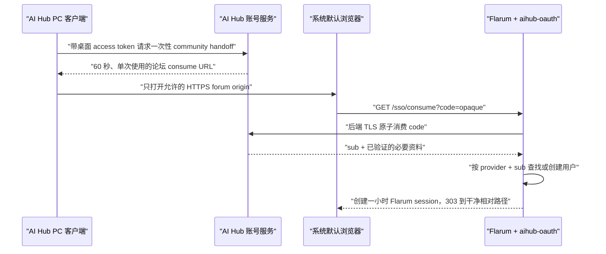

# Flarum 2.0 RC 与 AI Hub 统一登录集成结论

核验日期：2026-07-30  
研究范围：Flarum 官方文档、Flarum 官方源码仓库、FriendsOfFlarum OAuth 官方仓库。  
本文件是技术决策与落地说明，不包含实现代码。

## 结论

AI Hub 当前可以在本地 Docker 环境使用 Flarum 2.0 RC 搭建社区，并与 AI Hub 账号形成统一登录，但需要接受两项边界：

1. Flarum 2.0 尚处于 RC 阶段。当前官方安装文档列出的版本是 `2.0.0-rc.5`，官方明确要求在依赖它之前进行备份和测试。[Flarum 2.x 安装说明](https://docs.flarum.org/2.x/install/)
2. 当前有可用于 Flarum 2 的 FriendsOfFlarum OAuth 2.x 扩展，但它本身仍是 `2.0.0-beta.3`。它适合承载 OAuth 2.0 Authorization Code 登录；不能未经额外实现和验证就把它宣称为完整的通用 OIDC 客户端。[FoF OAuth 2.x 仓库](https://github.com/FriendsOfFlarum/oauth/tree/2.x)

推荐方案是：

- AI Hub 账号服务作为唯一身份源和 OAuth 2.0 Authorization Server。
- Flarum 作为 OAuth 2.0 Client。
- Flarum 安装 `fof/oauth` 2.x，并增加一个很薄的 `aihub-oauth` Provider 扩展。
- 普通网页登录走标准 OAuth 2.0 Authorization Code + PKCE。
- PC 客户端通过系统默认浏览器打开一次性 handoff，由 Flarum 扩展后端消费并建立短时论坛会话。
- PC 客户端绝不把自己的 bearer token、refresh token、Flarum access token 或 Cookie 放进 URL。

这能实现“PC 客户端已经登录，点击社区后浏览器自动进入已登录论坛”，同时保持浏览器 Cookie、论坛会话和 PC 客户端令牌相互隔离。

## 版本兼容性

| 组件 | 当前核验版本 | 兼容性证据 | 决策 |
|---|---|---|---|
| Flarum | `2.0.0-rc.5` | 官方 2.x 安装页列出 rc.5；官方 `2.x` skeleton 当前依赖 `flarum/core:^2.0.0-rc.5`。[官方 skeleton composer.json](https://github.com/flarum/flarum/blob/2.x/composer.json) | 本地 Beta 可以固定使用；不得以 `latest` 漂移 |
| PHP | `8.3+` | Flarum rc.5 的官方包要求 PHP `^8.3`，安装文档也要求 PHP 8.3+。[rc.5 composer.json](https://github.com/flarum/core/blob/v2.0.0-rc.5/composer.json) | Docker 镜像固定 PHP 8.3 小版本或摘要 |
| 数据库 | PostgreSQL 10+，推荐 15/16/17 | 官方 2.x 安装页列出 PostgreSQL 支持，并建议新部署使用 15、16 或 17。[数据库要求](https://docs.flarum.org/2.x/install/#server-requirements) | 本地优先 PostgreSQL 17，与账号服务分库、分用户 |
| FoF OAuth | `2.0.0-beta.3` | 2.x 分支声明依赖 `flarum/core:^2.0.0`；升级文档明确 2.x 是针对 Flarum 2.0 的重写。[composer.json](https://github.com/FriendsOfFlarum/oauth/blob/2.x/composer.json)、[2.x 升级说明](https://github.com/FriendsOfFlarum/oauth/blob/2.x/UPGRADE.md) | 固定 beta.3；每次升级先做兼容性测试 |

### 必须固定的依赖

镜像构建后必须提交 `composer.lock`，并在构建中使用锁文件。不能每次容器启动时执行不带版本约束的 `composer update`，否则 RC 和 Beta 扩展可能在未验收的情况下变化。

建议的基线是：

```text
Flarum:        2.0.0-rc.5
fof/oauth:     2.0.0-beta.3
PHP:           8.3.x pinned
PostgreSQL:    17.x pinned
```

正式公开发布前，应重新判断 Flarum 2.0 stable 和 FoF OAuth 2.0 stable 是否已经发布；如果仍未稳定，论坛必须继续标记为 Beta。

## OAuth 2.0、OIDC 与 SSO 的区别

### 当前确认可用：OAuth 2.0

FoF OAuth 2.x 提供：

- OAuth 2.0 登录与注册；
- 账号绑定；
- OAuth `state` 校验；
- Provider 可选 PKCE，2.x 要求每个 Provider 明确实现 `pkceEnabled()`；
- 按 Provider 的不可变用户标识关联 Flarum 用户；
- 登录后创建 Flarum remember token 和论坛会话；
- `returnTo` 只接受以 `/` 开头的相对路径，拒绝绝对 URL，降低开放重定向风险。

证据：

- [FoF OAuth 2.x README](https://github.com/FriendsOfFlarum/oauth/blob/2.x/README.md)
- [FoF OAuth 2.x Provider 升级要求](https://github.com/FriendsOfFlarum/oauth/blob/2.x/UPGRADE.md)
- [OAuth 控制器的 state、PKCE 和 returnTo 校验](https://github.com/FriendsOfFlarum/oauth/blob/2.x/src/Controllers/AbstractOAuthController.php)

AI Hub 的 Provider 应使用 AI Hub 账号的永久、不可复用 `sub/user_id` 作为 `identifier`，不要使用昵称、手机号或可修改邮箱作为外部账号主键。

### 当前没有确认：通用 OIDC

在限定的一手来源中，没有找到 Flarum 2.0 RC 自带的通用 OIDC Relying Party，也没有找到由 Flarum Core 或 FriendsOfFlarum 维护并明确支持 2.0 RC 的通用 OIDC 扩展。

FoF OAuth 2.x 处理的是 OAuth 2.0 Provider、access token 和 resource owner。它支持 PKCE，但其公开实现材料没有证明会完成 OIDC 所要求的全部 ID Token 校验，例如：

- issuer；
- audience；
- nonce；
- ID Token 签名与 JWKS；
- `at_hash` 等 OIDC 特定校验。

因此：

- 第一版统一登录只声明为 OAuth 2.0 SSO。
- 即使 AI Hub 账号服务提供 OIDC discovery 和 ID Token，Flarum 侧也不能在未实现上述校验前宣称“已完成 OIDC”。
- 后续若必须支持标准 OIDC，应在 `aihub-oauth` 扩展中增加完整验证并写集成测试，或等待明确兼容 Flarum 2 stable 的可信 OIDC 扩展。

### SSO 的实际含义

SSO 由“AI Hub 账号是唯一身份源”实现，并不是共享数据库、复制密码或把 PC Token 塞给 Flarum。



普通浏览器用户仍可以从 Flarum `/auth/aihub` 进入 OAuth Authorization Code + PKCE 流程。PC handoff 是桌面已登录状态到系统浏览器的短时桥接，不替代标准网页登录。

## PC 客户端安全打开已登录论坛

### 推荐流程

1. PC 客户端确认本地登录状态有效。
2. 客户端通过正常 API 请求 `POST /v1/auth/browser-handoffs`。
3. 账号服务创建至少 128-bit 随机高熵 opaque code，只在数据库保存其哈希，绑定：
   - AI Hub 用户；
   - `audience=community-browser`;
   - 已批准的论坛 client ID；
   - 一个经过规范化的论坛相对路径；
   - 30–60 秒过期时间；
   - 单次消费状态。
4. API 返回固定 origin 下的地址，例如：

   ```text
   https://community.example.com/sso/consume?code=<opaque>
   ```

5. PC 主进程只允许使用系统默认浏览器打开后台签名配置中的精确 HTTPS forum origin。渲染进程不能传入任意 URL。
6. `aihub-oauth` 的 consume endpoint 将 code 通过后端 TLS 发送给账号服务并原子消费；响应只返回最小身份资料。
7. 扩展按 `(provider=aihub, identifier=sub)` 查找或创建用户，生成 `SessionAccessToken`，并调用 Flarum `SessionAuthenticator::logIn()`。
8. 登录成功后立即 `303` 到不含 code 的同源相对路径。

Flarum rc.5 的 `SessionAccessToken` 空闲有效期是一小时；`SessionAuthenticator` 会在登录时重新生成 Session ID。[SessionAccessToken](https://github.com/flarum/core/blob/v2.0.0-rc.5/framework/core/src/Http/SessionAccessToken.php)、[SessionAuthenticator](https://github.com/flarum/core/blob/v2.0.0-rc.5/framework/core/src/Http/SessionAuthenticator.php)

FoF OAuth 的默认 `ResponseFactory` 会生成 `RememberAccessToken`，而 rc.5 源码中的默认期限是五年。普通网页登录如沿用该默认行为，UI 必须明确“记住登录”；PC 一键 handoff 不得默认发放该长期令牌。[ResponseFactory](https://github.com/flarum/core/blob/v2.0.0-rc.5/framework/core/src/Forum/Auth/ResponseFactory.php)、[RememberAccessToken](https://github.com/flarum/core/blob/v2.0.0-rc.5/framework/core/src/Http/RememberAccessToken.php)

### 明确禁止

- 禁止 `https://forum/...?...token=<PC access token>`。
- 禁止把 refresh token、JWT、Flarum API key 或 Cookie放到 URL、命令行或 Electron IPC 日志。
- 禁止 PC 客户端直接写入 Chrome、Edge 或 Flarum 的 Cookie 存储。
- 禁止在 Electron 内嵌 WebView 中复用 PC 主会话。
- 禁止接受后台下发的任意 forum origin 或任意 `returnTo`。
- 禁止使用邮箱作为唯一账号绑定键。
- 禁止 PC handoff 默认签发五年有效的 `RememberAccessToken`。

### Flarum 会话安全依据

Flarum rc.5 的 Cookie 工厂会把会话 Cookie设置为 `HttpOnly`，根据站点 URL 自动决定 `Secure`，默认 `SameSite=Lax`；登录时会重新生成 Session ID，降低 session fixation 风险。

- [CookieFactory](https://github.com/flarum/core/blob/v2.0.0-rc.5/framework/core/src/Http/CookieFactory.php)
- [SessionAuthenticator](https://github.com/flarum/core/blob/v2.0.0-rc.5/framework/core/src/Http/SessionAuthenticator.php)

生产环境仍必须显式使用 HTTPS，并检查最终 `config.php` 中的站点 URL、Cookie domain、path、secure 和 samesite 配置。

## 账号创建与绑定规则

FoF OAuth 会优先按照 `(provider, identifier)` 查找已有登录绑定。如果 Provider 调用了 `provideTrustedEmail()`，Flarum 的认证响应工厂还会把相同邮箱的已有用户自动绑定并登录。[ResponseFactory](https://github.com/flarum/core/blob/v2.0.0-rc.5/framework/core/src/Forum/Auth/ResponseFactory.php)

这带来一个必须处理的账号接管风险：

- AI Hub 只有在邮箱已完成验证、邮箱归一化规则固定且禁止不同账号复用邮箱时，才可以调用 `provideTrustedEmail()`。
- 第一版更稳妥的做法是以 AI Hub 不可变用户 ID 建立 Provider 绑定，并把邮箱只作为建议值；遇到同邮箱旧论坛账号时要求用户登录旧账号后主动绑定。
- 删除 AI Hub 账号时，应撤销新的授权和 browser handoff；论坛内容的匿名化、保留或删除要按独立的数据政策执行。

FoF OAuth 支持用户管理关联 Provider，也暴露相关管理权限。其 README 要求 `Moderate Access Tokens` 权限至少与管理用户 Provider 绑定的权限一样严格，后台配置时必须遵守这一点。[FoF OAuth 权限说明](https://github.com/FriendsOfFlarum/oauth/blob/2.x/README.md)

## Docker 自动初始化方案

### 官方能力与边界

Flarum 官方没有在 2.x 安装文档中指定官方 Docker 镜像。官方支持的自动化基础是：

- Composer 创建项目：

  ```text
  composer create-project flarum/flarum:^2.0.0 --stability=beta .
  ```

- Flarum CLI 的非交互安装：

  ```text
  php flarum install --file=/run/flarum-install.yaml
  ```

Flarum rc.5 的 `install` 命令明确支持 `--file/-f` 读取 JSON 或 YAML，以及 `--config/-c` 指定写入 `config.php` 的位置。[InstallCommand](https://github.com/flarum/core/blob/v2.0.0-rc.5/framework/core/src/Install/Console/InstallCommand.php)、[FileDataProvider](https://github.com/flarum/core/blob/v2.0.0-rc.5/framework/core/src/Install/Console/FileDataProvider.php)

因此可以自行构建可重复的 Docker 镜像，但不能把社区维护镜像描述为“Flarum 官方镜像”。

### 建议的容器拓扑

| 服务 | 职责 | 对外暴露 |
|---|---|---|
| `community-db` | PostgreSQL，社区独立数据库和用户 | 不暴露宿主机端口 |
| `community-init` | 单次初始化、迁移、启用固定扩展、清缓存 | 不暴露端口，执行结束退出 |
| `community-php` | 固定 Flarum 源码与 PHP-FPM | 仅 Docker 内网 |
| `community-web` | Caddy/Nginx，服务 Flarum `public` 目录 | 本地阶段绑定 `127.0.0.1` |
| `community-scheduler` | 每分钟执行 `php flarum schedule:run` | 不暴露端口 |

Flarum 官方建议所有调度任务统一由每分钟一次的 `php flarum schedule:run` 触发。[Scheduler](https://docs.flarum.org/2.x/scheduler/)

### 镜像构建阶段

1. 使用固定 PHP 8.3 基础镜像和固定 Composer 版本。
2. 安装 Flarum 官方列出的 PHP 扩展。使用 PostgreSQL 时安装 `pdo_pgsql`，同时保留 rc.5 [Installation 前置检查](https://github.com/flarum/core/blob/v2.0.0-rc.5/framework/core/src/Install/Installation.php) 当前仍要求的 `pdo_mysql`，直到该 RC 行为被上游修正或重新核验。
3. 根据固定版本生成项目。
4. 固定安装 `fof/oauth:2.0.0-beta.3` 和仓库内审计过的 `aihub-oauth` 扩展。
5. 提交并使用 `composer.lock`；生产镜像只执行 `composer install --no-dev --prefer-dist --classmap-authoritative`。
6. Web root 必须是 Flarum 的 `public` 目录，不能把项目根目录暴露给 Web 服务器。官方安装文档将这一点列为保护源文件的安全最佳实践。[Public path 说明](https://docs.flarum.org/2.x/install/#customizing-paths)

### 首次启动

`community-init` 应是唯一可以执行初始化的 one-shot 服务：

1. 等待 PostgreSQL 健康。
2. 获取 Docker secrets 中的数据库密码和初始管理员密码。
3. 在容器 tmpfs 的 `/run` 中生成安装 YAML，不能把密码烘焙进镜像或提交仓库。
4. 如果持久化应用根目录中不存在 `config.php`，执行：

   ```text
   php flarum install --file=/run/flarum-install.yaml
   ```

5. 如果已经存在 `config.php`，不重复安装，只执行受控的：

   ```text
   php flarum migrate
   php flarum assets:publish
   php flarum cache:clear
   ```

6. 安装完成后删除 tmpfs 中的安装 YAML，并让 init 容器退出成功。
7. Web 容器只有在 init 成功后启动。

`--config` 在 rc.5 中是相对于 Flarum 项目根目录的路径，不应传入 `/data/config.php` 之类的绝对路径。Docker 需要持久化根目录中的 `config.php`、`storage` 和 `public/assets`；若使用“不可变镜像 + 可写运行卷”，init 必须用版本清单受控地把镜像内容同步到应用卷，不能让 Web 请求在运行时执行 Composer 更新。

安装文件可以包含：

```yaml
debug: false
baseUrl: http://127.0.0.1:<local-port>
databaseConfiguration:
  driver: pgsql
  host: community-db
  port: 5432
  database: aihub_community
  search_path: public
  username: aihub_community
  password: <from-docker-secret>
  prefix: ""
adminUser:
  username: <from-docker-secret>
  password: <from-docker-secret>
  email: <from-docker-secret>
settings:
  forum_title: AI Hub 社区
queue:
  driver: database
```

字段结构来自 rc.5 的 [FileDataProvider](https://github.com/flarum/core/blob/v2.0.0-rc.5/framework/core/src/Install/Console/FileDataProvider.php)。示例中的 `<...>` 必须在 tmpfs 中替换，不得原样保存。

### 扩展管理

不建议在 AI Hub 本地后台安装 Flarum Extension Manager。Flarum 官方明确警告 Extension Manager 可以安装任意 Composer 包，只有完全信任所有论坛管理员时才能启用。[Extension Manager 警告](https://docs.flarum.org/2.x/install/#installing)

AI Hub 应坚持现有安全边界：

- 允许安装的 Flarum 扩展必须固定在代码仓库和 `composer.lock` 中。
- 后台只能启停已经打进镜像并经过审核的扩展，不能提交任意 Composer 包名。
- 不能让后台下发 PHP、Shell、PowerShell 或 CMD。

Flarum rc.5 提供 `extension:enable <extension-id>` 和 `extension:disable <extension-id>`，可在受控初始化阶段用于固定白名单扩展。[ToggleExtensionCommand](https://github.com/flarum/core/blob/v2.0.0-rc.5/framework/core/src/Extension/Console/ToggleExtensionCommand.php)

## 健康检查与验收

### 容器健康

- PostgreSQL `pg_isready` 成功。
- init 容器以 0 退出，且 `config.php` 存在。
- Forum 首页返回 200。
- `/api` 返回有效 JSON:API 文档。
- `php flarum info` 显示固定版本和已加载扩展。
- scheduler 容器持续运行且日志无重复失败。

### SSO 集成测试

必须覆盖：

1. 新 AI Hub 用户第一次进入社区并创建 Flarum 用户。
2. 已绑定用户再次进入时直接登录。
3. OAuth `state` 错误或丢失时拒绝登录。
4. PKCE verifier 不匹配时拒绝换取 token。
5. browser handoff code 过期、重复消费、篡改 audience 时失败。
6. 外部 `returnTo=https://evil.example` 被拒绝或归一为 `/`。
7. 同邮箱但不同 AI Hub 用户不能自动接管旧论坛账号。
8. PC 客户端退出登录后不能继续创建新的 handoff。
9. Flarum 单独退出后论坛 Cookie 和 access token 被撤销。
10. 数据库恢复后 Provider 绑定仍与 AI Hub 不可变用户 ID 一致。

### PC 客户端验收

- 点击“社区”只打开系统默认浏览器。
- 打开的 origin 与签名配置中的社区 origin 完全一致。
- URL 中只出现一次性 opaque code，不出现 JWT、邮箱、手机号或 Flarum token。
- 正常流程无需在论坛再次输入 AI Hub 密码。
- 论坛页面刷新后仍保持 Flarum 自己的安全会话。

## 已知风险

| 风险 | 影响 | 当前处理 |
|---|---|---|
| Flarum rc.5 和 FoF OAuth beta.3 尚未稳定 | API 或扩展兼容性可能变化 | 固定版本与锁文件；升级前备份并跑完整测试 |
| FoF OAuth 不是已确认的通用 OIDC RP | 错误宣称 OIDC 会遗漏 ID Token 验证 | 第一版只声明 OAuth 2.0 SSO |
| 可信邮箱自动绑定 | 未验证邮箱可能造成账号接管 | 默认不自动按邮箱绑定；优先不可变 provider identifier |
| PC 已退出但论坛浏览器会话仍存在 | 用户可能误认为全局退出 | UI 明确区分；后续设计 back-channel/session revocation |
| FoF OAuth 默认 remember token 为五年 | 浏览器长期保持论坛登录 | PC handoff 固定使用一小时 `SessionAccessToken`；普通网页登录显式选择是否记住 |
| 一次性 handoff 被日志或恶意程序截获 | 短时间内可能被抢先消费 | 随机高熵、只存哈希、30–60 秒、单次消费、HTTPS、日志脱敏 |
| RC 数据迁移失败 | 社区不可用或数据损坏 | 每次升级前数据库和上传文件双备份；先在副本演练 |
| 扩展供应链 | Composer 依赖可能引入未审计代码 | 固定白名单、`composer.lock`、禁用公网 Extension Manager |

## 最终决策

本地阶段可以开始搭建：

- `Flarum 2.0.0-rc.5`
- `FoF OAuth 2.0.0-beta.3`
- `PostgreSQL 17`
- 自有、最小化的 `aihub-oauth` Provider
- 普通网页登录：OAuth 2.0 Authorization Code + PKCE
- PC 一键进入：一次性 handoff + 一小时 Flarum session + 系统默认浏览器

本地阶段的验收目标是 OAuth 2.0 SSO，不是 OIDC 认证。等 Flarum 和 OAuth 扩展进入 stable，或 `aihub-oauth` 完成标准 OIDC 校验后，再升级对外的能力声明。
